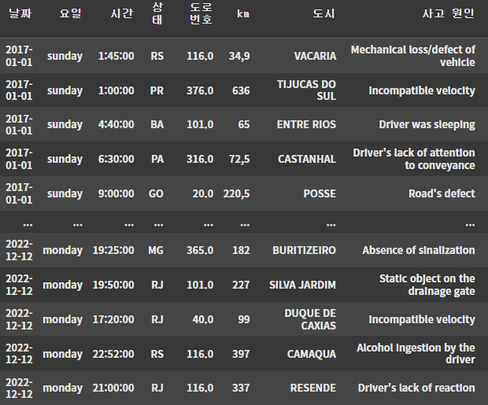
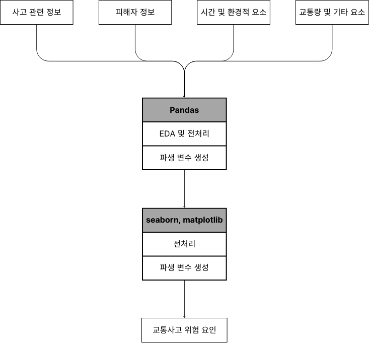
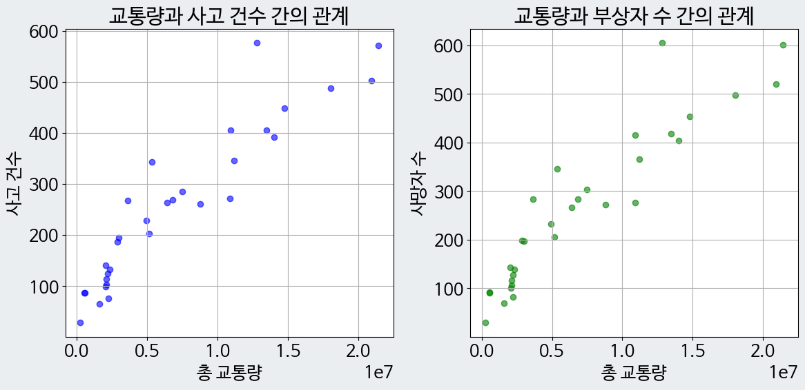
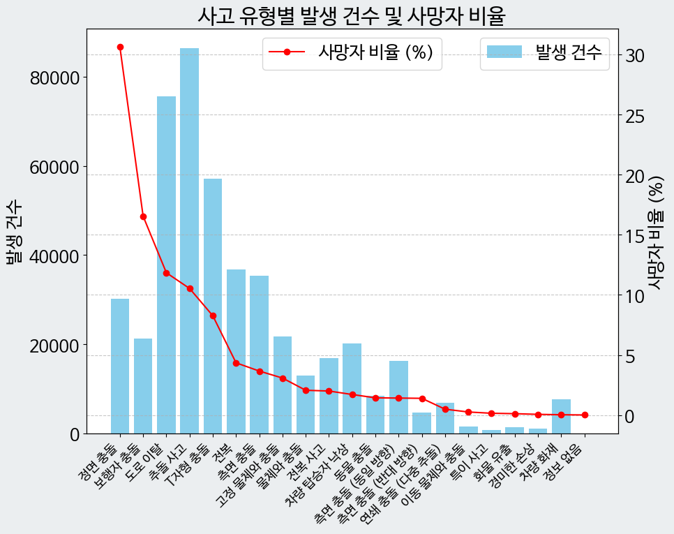
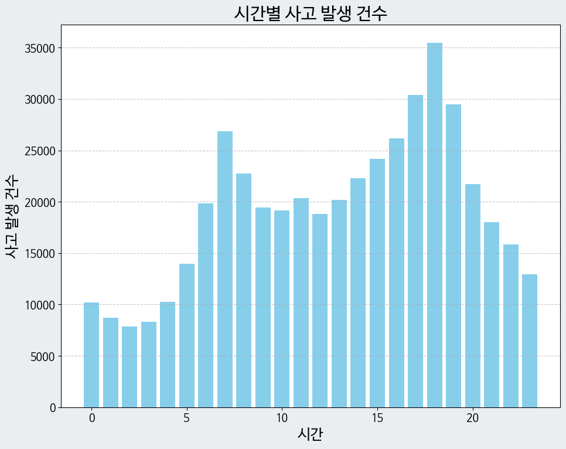
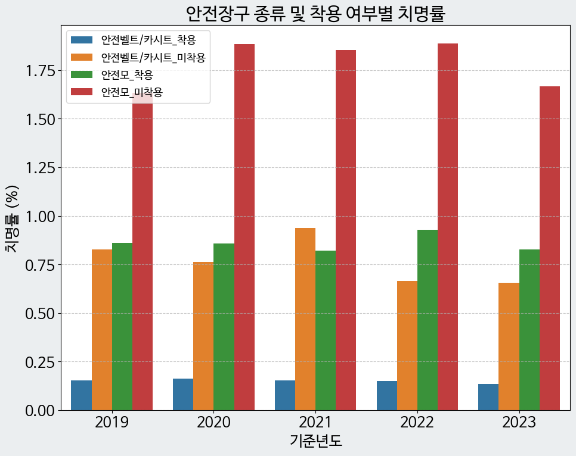
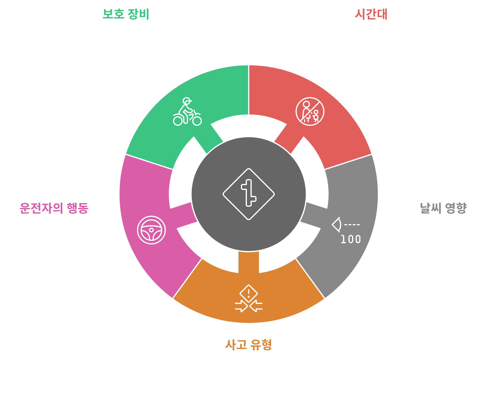

# 교통사고 위험 요인 분석 프로젝트  

## 목차  
1. [프로젝트 소개](#프로젝트-소개)  
2. [데이터 설명](#데이터-설명)  
3. [분석 과정](#분석-과정)  
4. [주요 결과](#주요-결과)  
5. [결론](#결론)  

## 프로젝트 소개  
- **기간**: 2024년 10월 30일 ~ 2024년 11월 30일  
- **프로젝트 목적**:  
  교통사고 데이터 분석을 통해 사고 발생 원인과 위험 요소를 파악하고, 안전성 강화를 위한 정책적 인사이트를 제시.  
  사고 유형, 시간대, 교통량, 날씨 등 다양한 변수를 활용하여 사고 발생 메커니즘을 분석.  

## 데이터 설명  

### 데이터 출처 및 주요 변수  
1. **Car Accidents in Brazil** (Kaggle, 2017~2023)  
   - 주요 변수: 사고 날짜, 시간, 사망자 수, 사고 원인, 사고 유형 등.  

2. **도로교통공단 교통사고 정보** (공공데이터 포털, 2012~2023)  
   - 주요 변수: 날짜, 사망자 수, 지역, 사고 건수 등.  

3. **시군별 차로당 교통량** (경기 데이터 드림, 2002~2023)  
   - 주요 변수: 연도, 지역, 교통량.  

4. **안전 장비 착용 데이터** (TAAS, 2019~2023)  
   - 주요 변수: 연도, 사망자 수, 안전 장비 착용 여부.  

데이터셋은 아래와 같이 크게 4가지 유형의 데이터로 구분되어 있음

  |데이터 유형|데이터 내용|
  |---|---|
  |사고 관련 정보|각 사고의 정보(발생 시간, 원인, 유형 등)|
  |피해자 정보|각 사고의 피해자의 정보(부상자, 사망자 등)|
  |시간 및 환경 요소|각 사고의 시간 및 환경 요소(도로 형태, 시간대, 날씨 등)|
  |교통량 및 기타 정보| 각 사고 지역의 교통량 및 기타 정보(보호 장비 착용 여부 등)|

### 주요 변수
- 사고 날짜, 시간, 사고 원인, 사고 유형, 사망자 수, 날씨 상태 등.

## 주요 액션  

    

## 분석 과정  

### 1. 데이터 전처리  
1. **결측치 처리**  
   - 데이터에서 중요 변수(사망자 수, 사고 원인 등)의 결측치는 없었으나, 사용하지 않는 데이터의 결측치는 제거.  

2. **중복 데이터 제거**  
   - 중복된 사고 데이터를 제거하여 총 12개의 행 제거.  

3. **데이터 병합**  
   - 사고 데이터와 교통량 데이터를 `날짜`와 `지역` 기준으로 병합.  
   - 병합 후 일치하지 않는 데이터를 제거하여 정확성 확보.  

4. **번역 및 정제**  
   - 영어로 작성된 Kaggle 데이터를 한국어로 번역하고 불필요한 열 삭제.  

### 2. 데이터 분석  
1. **상관분석**
   

  

   - 교통량과 사고 건수 간 상관계수: **0.93**.  
   - 교통량과 사망자 수 간 상관계수: **0.93**.  

2. **사고 유형별 분석**
 
 

   
 

 
   - 정면 충돌과 보행자 충돌 사고가 사망자의 47% 차지.  
   - 보행자 관련 사고 치명률: **30%**.  

3. **시간대 및 날씨별 사고 분석**
   

  

    
   - 사고가 가장 많이 발생한 시간대: **18~19시 (퇴근 시간대)**.  
   - 치명률이 가장 높은 날씨: **안개 (10.53%)**.  

4. **안전 장비 착용 효과**  

  

   - 안전벨트 미착용 시 치명률: **0.77** (착용 시 0.15보다 약 5배 높음).  

## 주요 결과  

 

1. **사고 원인 분석**  
   - 운전자의 부주의가 가장 많은 사고 발생 원인.  
   - 과속과 보행자 관련 사고가 높은 치명률 유발.  

2. **시간대 및 날씨 요인**  
   - 퇴근 시간대와 주말에 사고 건수와 사망자 수 증가.  
   - 안개와 관련된 사고의 치명률이 가장 높음.  

3. **교통량과 사고 발생**  
   - 교통량이 증가함에 따라 사고 건수 및 사망자 수 증가.  

4. **안전 장비 착용 효과**  
   - 안전 장비 착용은 치명률 감소에 크게 기여.  

## 결론  

이번 프로젝트를 통해 브라질 교통사고 데이터를 분석하며, 교통사고의 주요 원인과 그 위험 요소를 깊이 이해할 수 있었습니다. 특히, 사고 유형과 시간대, 날씨, 교통량이 사고의 빈도와 심각성에 미치는 영향이 명확히 드러났습니다.  

정면 충돌과 보행자 충돌 사고는 사고 건수는 적지만 치명률이 높아, 예방을 위해 특별한 주의가 필요함을 알 수 있었습니다. 보행자 관련 사고는 치명률이 약 30%로, 보행자와 운전자의 주의와 함께 보행자 보호 시설 강화가 중요합니다.  

시간대별로는 퇴근 시간대(18~19시)에 사고와 사망자가 가장 많이 발생했으며, 이는 교통량 증가와 시야 제한이 복합적으로 영향을 미쳤을 가능성이 큽니다. 주말 동안 사고 발생률이 급증한 점은 장거리 운전과 음주운전 등의 위험 요인을 다시 한번 주목하게 만듭니다.  

날씨 요인 중에서는 안개가 사고 건수는 적지만 치명률이 가장 높은 날씨 조건으로 나타났습니다. 이는 시야 제한이 사고의 심각성을 높인다는 점에서 안개 발생 지역의 안전 관리가 중요함을 보여줍니다.  

마지막으로, 안전 장비 착용은 치명률 감소에 가장 큰 기여를 하는 요소로 분석되었습니다. 안전벨트와 안전모 착용 여부에 따라 치명률이 최대 5배까지 차이가 난다는 결과는, 개인의 안전 수칙 준수가 교통사고 피해 경감을 위해 필수적임을 강조합니다.  

이번 분석 결과는 교통사고의 주요 위험 요인을 체계적으로 이해하고, 교통 안전을 개선하는 데 유용한 정보를 제공할 것입니다.  

---  
